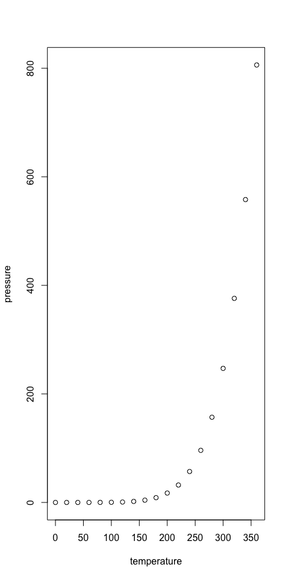

Untitled
================

-   [The main header](#the-main-header)
    -   [The secondary header](#the-secondary-header)

# The main header

## The secondary header

`some text formatted as code` The mean speed of the cars dataset is 15.4
3.1428571

``` r
plot(pressure)
```



``` r
knitr::include_graphics("rmarkdown_logo.png")
```


knitr::include\_graphics(“path/to/image/file”)

*Some text here*

**A header here**

``` r
knitr::kable(cars)
```

| speed | dist |
|------:|-----:|
|     4 |    2 |
|     4 |   10 |
|     7 |    4 |
|     7 |   22 |
|     8 |   16 |
|     9 |   10 |
|    10 |   18 |
|    10 |   26 |
|    10 |   34 |
|    11 |   17 |
|    11 |   28 |
|    12 |   14 |
|    12 |   20 |
|    12 |   24 |
|    12 |   28 |
|    13 |   26 |
|    13 |   34 |
|    13 |   34 |
|    13 |   46 |
|    14 |   26 |
|    14 |   36 |
|    14 |   60 |
|    14 |   80 |
|    15 |   20 |
|    15 |   26 |
|    15 |   54 |
|    16 |   32 |
|    16 |   40 |
|    17 |   32 |
|    17 |   40 |
|    17 |   50 |
|    18 |   42 |
|    18 |   56 |
|    18 |   76 |
|    18 |   84 |
|    19 |   36 |
|    19 |   46 |
|    19 |   68 |
|    20 |   32 |
|    20 |   48 |
|    20 |   52 |
|    20 |   56 |
|    20 |   64 |
|    22 |   66 |
|    23 |   54 |
|    24 |   70 |
|    24 |   92 |
|    24 |   93 |
|    24 |  120 |
|    25 |   85 |

<font size = "1"> This text should be really small </font>

<font size="20"> This text should be really big </font>
